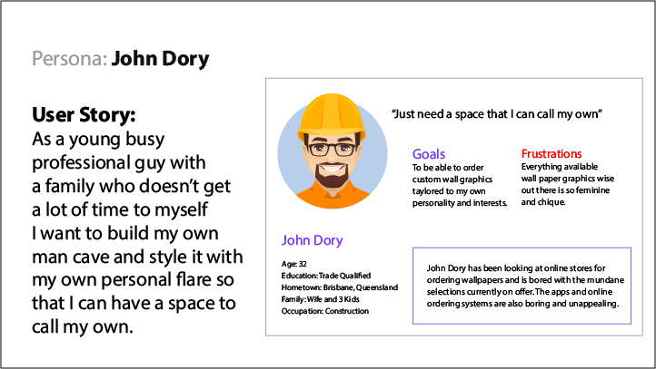

## Super Fly WallPapers

An e-commerce platform to sell wall papers & wide format graphics targeted at streamers/ gamers as opposed to your standard baby nursery/ interior decor demographic.

### Purpose:

To offer wide format printing services to a more specific target demographic and in doing so, scaling back my business to a point where I can ship graphics instead of having to perform site measures and installs. The quoting calculator will allow the customer to perform their own measurements and the fact that I'll be shipping only means graphics will be rolled up for customer to DIY or sub-contract an external installer.

To create and deploy a full stack application/ e-commerce website using the MERN stack. Fully functioning backend API that will allow customers to register as users, browse, rate & favourite wall-paper designs. Ultimately affording them the opportunity to order, pay for and have shipped wide format graphics and wall papers. Quoting calculator highly desirable as well as ai image generation would be nice to have.

### Functionality/ Features.

Overall function of website is to operate as an online store and gallery for specialised, themed wall paper graphics.

Features should include;

- User Auth/ Register and Login
- Site Nav
- Gallery
- Quoting Calculator
- Contact & Email Form

Nice to Have;

- Shopping Cart Checkout and Billing services
- Image carousel on home page
- AI Image generation tool through mid-journey or similar.

### Target Audience

- Gamer/streamer demographic as opposed to your traditional baby nursery/ interior decor.
- Men who want to create a personal space/ man cave
- Families with young kids who want to customise bedroom wall graphics.

### Tech Stack

- MongoDB
- Express.js
- React.js
- Node.js

Server-side programming: React 
Back-end framework: Express, NodeJS, MongoDB 
Database Cloud Deployment: Mongo Atlas 
Client application: Insomnia 
Development IDE: Visual Studio Code  
Deployment Platform: Heroku 

### Application Architecture Diagrams.
#### Simple architecture diagram (development framework)

#### High level architecture diagram.

### Dataflow Diagram.

* User Browse Wallpapers/ Favourite / Quoting Calculator & CheckOut.

### User Stories

### Wire Framing.

[Link to FIGMA Wireframes](https://www.figma.com/file/tZyl4fFYDeD18c5S83xF4D/Superfly-Wallpapers?type=design&node-id=0%3A1&mode=design&t=Af6bWIVOgTxsJLr2-1)

### _Mobile:_
#### UI/UX componenets:
* Emphasis on iconography.
* Shopping Cart icon accessable from almost every page.
* No more than 2 column layout in small screen view.
* Use of hamburger menu for mobile view.

### _Tablet:_
#### UI/UX componenets:
* Responsive Design for small, medium large screens and everything in-between. 
* Navigation no longer requires hamburger menu and can be displayed in full. 
* As the components are displayed in sections multiple components can now be displayed on the various pages where applicable.

### _Desktop:_
#### UI/UX componenets:
* View can extend to utilise a 12 column layout (bootstrap).
* More thumbnails can be displayed per page.
* Continue strong emphasis on iconography and high contrast in elements such as buttons to match branding style.

[Link to Trello Board](https://trello.com/b/tOPvO0T0/super-fly-wallpapers)

Initial set up of Kanban board specifically focusing on Design stages of project.

Wireframes Completed! 6-7-23

Dataflow & Architecture Diagrams, user personas & stories completed. 8-7-23

[Watch the Presentation](https://youtu.be/5tVrtYYZCO4)
